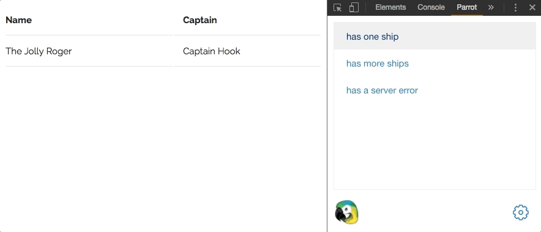

<h1 align="center">
  
</h1>

Parrot is a set of tools that allow you to create HTTP mocks and organize them into scenarios in order to develop your app against different sets of data. We have implemented all of Parrot's functionality in JavaScript, but [scenarios](https://github.com/americanexpress/parrot/blob/main/SCENARIOS.md) are a general specification that can be implemented in any language.

## 👩‍💻 Hiring 👨‍💻

Want to get paid for your contributions to `parrot`?

> Send your resume to oneamex.careers@aexp.com

## 🤹‍ Usage

Let's walk through a common development workflow using Parrot.

#### Define your [scenarios](https://github.com/americanexpress/parrot/blob/main/SCENARIOS.md)

```js
import { describe, it, get, post, graphql } from 'parrot-friendly';
import casual from 'casual'; // for generating fake data
import schema from './schema'; // our GraphQL schema

const scenarios = describe('Ship Log', () => {
  it('has a ship log', () => {
    // respond with a mock JSON file and add a delay
    get('/ship_log')
      .response(require('./mocks/shipLog.json'))
      .delay(1200);

    // respond with the request body that was sent
    post('/ship_log').response(req => req.body);
  });

  it('has a random ship log', () => {
    // respond with random data generated by casual
    get('/ship_log').response(() => [
      {
        port: casual.city,
        captain: casual.full_name,
      },
    ]);
  });

  it('has a server error', () => {
    // respond with a 500 status
    get('/ship_log').status(500);
  });

  it('has a ship log from GraphQL', () => {
    // respond to GraphQL queries
    graphql('/graphql', schema, () => ({
      ShipLog: () => require('./mocks/shipLog.json'),
    }));
  });
});

export default scenarios;
```

More information about writing scenarios can be found in the [scenarios documentation](https://github.com/americanexpress/parrot/blob/main/SCENARIOS.md).

#### Add them to your server

```js
import express from 'express';
import parrot from 'parrot-middleware';
import scenarios from './scenarios';

const app = express();
app.use(parrot(scenarios));
app.listen(3000);
```

#### Develop with Parrot's [devtools](https://github.com/americanexpress/parrot/blob/main/packages/parrot-devtools)



#### Example API requests

Fetch current scenario.

```sh
$ curl 'http://localhost:3002/parrot/scenario'
```

Fetch all scenarios.

```sh
$ curl 'http://localhost:3002/parrot/scenarios'
```

Setting parrot to a new scenario.

```sh
$ curl -X POST -H "Content-Type: application/json" -d '{ "scenario": "[scenario name here]" }'  'http://localhost:3002/parrot/scenario'
```

## 📦 Packages

Parrot is divided into several packages that can be used together depending on your use case.

| Name                                                                                                      | Description                                                     |
| --------------------------------------------------------------------------------------------------------- | --------------------------------------------------------------- |
| **[parrot-core](https://github.com/americanexpress/parrot/blob/main/packages/parrot-core)**             | Core Parrot functionality that can be extended to new use cases |
| **[parrot-devtools](https://github.com/americanexpress/parrot/blob/main/packages/parrot-devtools)**     | Devtools that allow you to switch between Parrot scenarios      |
| **[parrot-fetch](https://github.com/americanexpress/parrot/blob/main/packages/parrot-fetch)**           | Fetch mocking implementation of Parrot                          |
| **[parrot-friendly](https://github.com/americanexpress/parrot/blob/main/packages/parrot-friendly)**     | Helper library to write your scenarios in BDD style             |
| **[parrot-graphql](https://github.com/americanexpress/parrot/blob/main/packages/parrot-graphql)**       | Helper library to add GraphQL mocks to your scenarios           |
| **[parrot-middleware](https://github.com/americanexpress/parrot/blob/main/packages/parrot-middleware)** | Express middleware implementation of Parrot                     |
| **[parrot-server](https://github.com/americanexpress/parrot/blob/main/packages/parrot-server)**         | CLI to get a parrot server up and running                       |

## 🏆 Contributing

We welcome Your interest in the American Express Open Source Community on Github.
Any Contributor to any Open Source Project managed by the American Express Open
Source Community must accept and sign an Agreement indicating agreement to the
terms below. Except for the rights granted in this Agreement to American Express
and to recipients of software distributed by American Express, You reserve all
right, title, and interest, if any, in and to Your Contributions. Please [fill out the Agreement](https://cla-assistant.io/americanexpress/parrot).

Please see our [CONTRIBUTING.md](./CONTRIBUTING.md).

## 🗝️ License

Any contributions made under this project will be governed by the [Apache License 2.0](./LICENSE.md).

## 🗣️ Code of Conduct

This project adheres to the [American Express Community Guidelines](./CODE_OF_CONDUCT.md).
By participating, you are expected to honor these guidelines.
